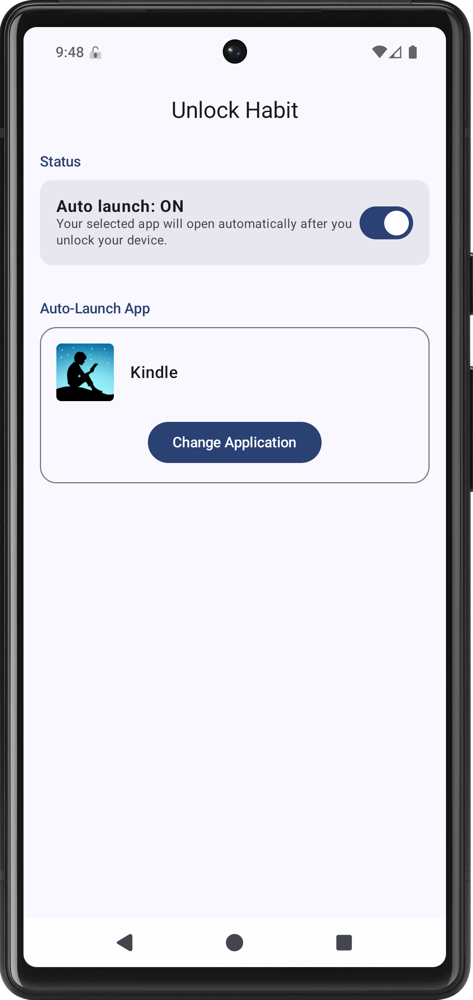
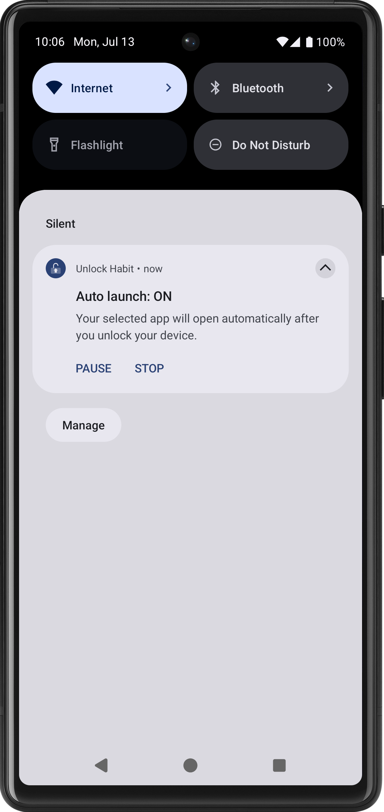

# Unlock Habit

Unlock Habit is an Android app that automatically launches a user-selected app whenever you
unlock your phone.

The goal is simple: help you replace mindless phone checking with intentional habits.

## Why?

I noticed a pattern in my daily routine. Whenever I had a few spare moments—waiting for a game to
load, a project to build, a commercial break, or the next episode of a TV show—I would instinctively
unlock my phone and start scrolling through social media or the news.

These moments weren't intentional. They were automatic.

Modern social media apps are designed to capture and hold our attention. Even a quick "I'll check
for a minute" can easily turn into much longer browsing sessions.

I wanted a healthier default.

Instead of opening social media, I wanted my phone to encourage me to read a book. Whether it's
Kindle, Google Play Books, Kobo, or any other app you choose, the idea is to make a positive habit
the first thing you see after unlocking your phone.

This app is not designed to block apps or restrict your device. You can dismiss it and continue
using your phone normally. Its purpose is to provide a gentle nudge toward more intentional screen
time.

## Features

- 📱 Automatically launches your selected app after unlocking your phone.
- 📚 Works with any app (Kindle, Google Play Books, Kobo, etc.).
- ⚡ Lightweight and battery-friendly.
- 🔒 [Privacy-friendly](PRIVACY_POLICY.md) — no account required and no personal data collected.
- 🎨 Built with Kotlin, Jetpack Compose, Hilt, and modern Android architecture.

## Getting Started

1. **Select App**: Open Unlock Habit and pick the app you want to launch (e.g., Kindle, a journal,
   etc.).
2. **Grant Permissions**: Follow the prompts to enable the required permissions.
3. **Test it out**: Press the power button to lock your phone, then unlock it.
4. **Verify**: Your selected app should automatically open!

## Screenshots

<p align="center">
  
  
</p>

## Google Play

*Coming soon.*

## Permissions

### Notifications

Android requires a persistent foreground service notification while the app is active. The
foreground service monitors device unlock events so the app can launch your selected app.

### Display over other apps

Required only to bring the app into the foreground before launching your selected app. Android
restricts background apps from directly launching other apps, so this permission is used solely to
work around that limitation. No visible overlay is displayed.

## Build

```bash
git clone git@github.com:prabint/Unlock-Habit-Android.git
cd Unlock-Habit-Android
./gradlew installDebug
```

## License

This project is licensed under the MIT License.